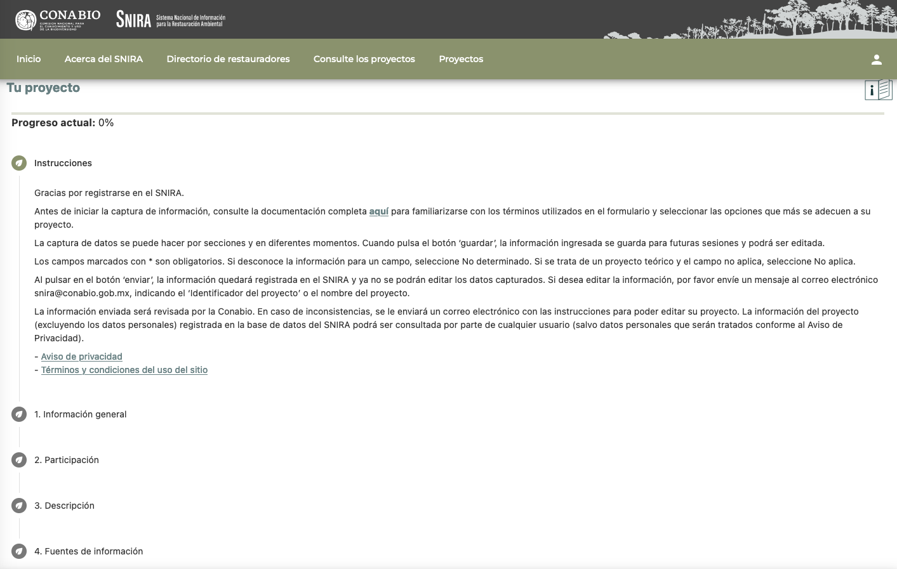

# Instrucciones generales  {.unnumbered}

 

La base de datos del SNIRA comprende cuatro secciones y 92 campos, de los cuales **34 son campos obligatorios marcados con un asterisco (\*)** que son imprescindibles llenarlos.

Se recomienda agregar toda la información disponible con la finalidad de enriquecer al SNIRA y apoyar al cumplimiento de los objetivos para los que fue diseñado. 

En la medida de lo posible, los campos incluyen catálogos de vocabulario controlado para facilitar la captura de información y estandarizar las respuestas en la base de datos. Por favor, seleccione la opción de respuesta que más se ajuste a su proyecto. En caso de no contar con información para un campo, por favor seleccione ‘No determinado’. Si el campo no aplica para su proyecto o cuando ninguna de las otras opciones es adecuada, por favor seleccione ‘No aplica’.

Si no encuentra una opción de respuesta que aplique a su proyecto, puede escribir su respuesta en los campos de texto abierto correspondientes; estos campos también sirven para poder proporcionar mayor detalle o escribir comentarios. Los campos de texto abierto se encuentran en todas las secciones y subsecciones del sistema.

Por favor, escriba y capture los datos en español. Si copia información de un documento, póngala entre comillas " " para indicar que es una cita textual. Si la información está en un idioma distinto al español, favor de traducirla; se puede usar un servicio de traducción como [Google](https://translate.google.com.mx/?hl=es), [DeepL](https://www.deepl.com/es/translator) u otro para apoyar con la traducción de textos al español.  En caso de usar un servicio de traducción, favor de indicar al final del texto lo siguiente, por ejemplo: (Traducido por Google).

----

## **Guardar información capturada** {.unnumbered}
Después de capturar los datos de cada sección y subsección, pulse ‘Guardar’ para almacenar la información ingresada. Si todos los campos obligatorios han sido llenados, el sistema abrirá una ventana con la leyenda 'Cambios guardados'. Pulse el botón ‘Aceptar’ para asegurar que la información haya sido guardada en el sistema. El botón de ‘Guardar’ solamente se activará cuando todos los campos obligatorios de una sección tengan información. **Si por algún motivo tiene que interrumpir el llenado de campos, asegúrese de llenar todos los campos obligatorios y pulsar el botón ‘Guardar’ para poder seguir la captura en otro momento**.

Pulse el botón ‘Siguiente’ para pasar a la siguiente sección o subsección. 

----

## **Editar información capturada** {.unnumbered}
Podrá editar la información las veces que sean necesarias mientras su proyecto esté en el estado de  **‘Edición’** (véase las ‘Instrucciones’ en la parte superior de la sección 1: Información general). Una vez que pulse el botón ‘Enviar a revisión mi proyecto’ (ubicado al final de los campos, es decir, después de la sección 4: Fuentes de información), automáticamente el estado del proyecto cambiará a ‘En revisión’ y ya no será posible hacer cambios. En caso de  que haya campos obligatorios vacíos o el sistema encuentre inconsistencias en los datos capturados, el estado se mantendrá en ‘Edición’. **Si requiere hacer algún cambio después de haber enviado el proyecto a revisión, deberá enviar un correo electrónico a snira@conabio.gob.mx**.

La información de su proyecto estará disponible para la consulta del público en general cuando los datos hayan sido revisados por el  equipo de trabajo de la Conabio y el proyecto se haya registrado en la base de datos del SNIRA. En ese caso, el estado del proyecto cambiará a ‘APROBADO’.

**Si su proyecto fue capturado en el sistema y quiere hacer alguna modificación, por favor de enviar un correo electrónico a snira@conabio.gob.mx, indicando el nombre,  ID del proyecto y  los cambios solicitados.**

A continuación se explican con detalle cada una de las secciones y los campos del SNIRA, además se proporcionan algunos ejemplos para la captura de información. 

----

## **Primer paso** {.unnumbered}
**Registre un nuevo proyecto**

En esta sección encontrará las instrucciones para la captura de la información en la base de datos, así como el [**Aviso de privacidad**](https://www.biodiversidad.gob.mx/conabio/proteccion-DP/ap-solicitudes-de-acceso-infopub) y los [**Términos y condiciones de uso del sitio**](https://www.gob.mx/terminos).

El primer campo obligatorio es ‘Nombre del proyecto’. Al escribir el nombre (en español) y pulsar el botón ‘Crear nuevo proyecto’, se habilitarán los demás campos para ingresar la información de su proyecto. Cuando la información que se captura es extraída de una publicación, ponga el título de la publicación en español.

{width="650"}

----

## **Ventana de inicio** {.unnumbered}

Después de ingresar el nombre del proyecto, mismo que podrá editar posteriormente si así lo desea, aparecerá la ventana principal donde podrá navegar entre secciones. Además, podrá observar el progreso actual en la captura de información en la parte superior izquierda.

{width="700"}
