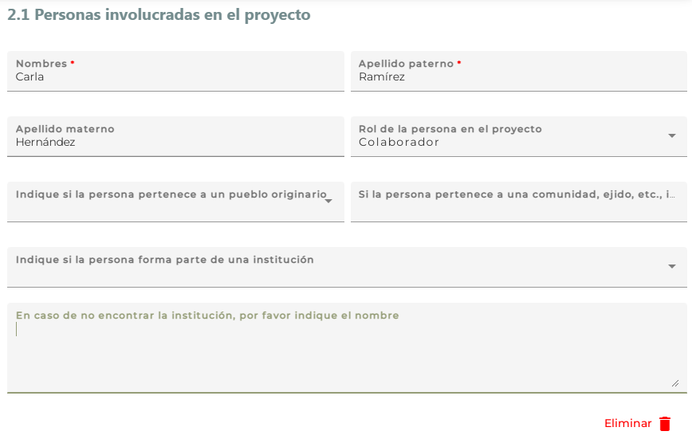

# Personas involucradas en el proyecto {.unnumbered}

 

Las personas participantes incluyen, p. ej., responsables o corresponsables de alguna fase del proyecto, investigadoras e investigadores participantes en el proyecto, las y los co-autores de una publicación, técnicos de campo, representantes de autoridades ejidales,  comunales o locales participantes, ayudantes de campo, estudiantes involucrados directamente en el proyecto, entre varias otras. 

La subsección comprende ocho campos; si agrega a una persona,
 **dos de los campos son obligatorios (\*)**.

Pulse ‘Agregar persona +’ para que se desplieguen los campos y pueda capturar los datos. Podrá agregar tantas personas como desee por medio del mismo botón. 

{width="200"}

En caso de haber agregado a una persona erróneamente o no va a capturar alguno de los campos obligatorios asociados a una persona, pulse ‘Eliminar’. Si detecta un error en alguno de los campos después de haber guardado la sección, deberá eliminar la persona y volver a capturar la información. 

Si no cuenta con información, pulse ‘Guardar’ y pase a la siguiente subsección.

{width="500"}

----

### Nombres\*  {.unnumbered}

Escriba el nombre de la persona.

----

### Apellido paterno\* {.unnumbered}

Escriba el apellido paterno de la persona.

----

### Apellido materno {.unnumbered}

Escriba el apellido materno de la persona.

----

### Rol de la persona en el proyecto {.unnumbered}

Seleccione la opción que corresponda: 

- Responsable: Persona física que gestionó, gestiona y gestionará el proyecto (project manager); en el caso de tesis; corresponde a tesistas.
- Corresponsable:  Persona física auxiliar de la gestión, manejo y administración del proyecto; ; en el caso de tesis; corresponde a las personas que dirigen o dirigieron la tesis.
- Colaborador: Persona física que contribuyó / contribuye / contribuirá de manera activa en el proyecto.
- Técnico: Especialista capacitado que apoyó / apoya /apoyará las labores del proyecto.
- Evaluador: Persona que participó / participa / participará en los procesos de evaluación, puede incluir a académicos, investigadores, técnicos, entre otros.
- Administrador de recursos: Persona encargada de la administración de recursos financieros.

----

### Indique si pertenece a algún pueblo originario.{.unnumbered}

Seleccione la opción de la lista que corresponda. 

El catálogo de nombres se tomó del Atlas de los pueblos indígenas de México del [INALI](http://atlas.inpi.gob.mx/pueblos-indigenas/). Si no está el nombre en la lista, por favor seleccione la opción ‘Otro’.

----

### Si la persona pertenece a una comunidad, ejido u otra propiedad social, indique el nombre.{.unnumbered}

Campo de texto abierto que permite introducir el nombre de la comunidad, ejido o propiedad social, p. ej., Ejido Mauricios.

----

### Indique si la persona forma parte de una institución{.unnumbered}

Seleccione la opción de la lista que corresponda.

----

### En caso de no encontrar la institución, por favor indique el nombre.{.unnumbered}

Campo de texto abierto que permite introducir el nombre de la organización, es decir la institución y su dependencia, p. ej., Colegio de Postgraduados, Campus Montecillo, Instituto de Recursos Naturales, Laboratorio de Etnobotánica. Si la persona no forma parte de  una organización, también se puede indicar en este campo, p. ej. consultor o prestador de servicios independiente. 

----

### Comentarios respecto a las personas involucradas{.unnumbered}
Campo de texto abierto que permite introducir comentarios, opiniones, etc. respecto a las personas involucradas.

----

### GUARDAR{.unnumbered}

**Pulse el botón ‘Guardar’, una vez que haya registrado los datos**.

En el caso de que todos los campos obligatorios hayan sido llenados, el sistema abrirá una ventana con la leyenda 'Cambios guardados'. Pulse el botón ‘Aceptar’ para asegurar que la información haya sido guardada en el sistema. Si no se abre la ventana, vuelva a presionar el botón ´Guardar´ al menos dos veces más.

Pulse el botón ‘Siguiente’ para pasar a la siguiente sección. 

Si algún campo obligatorio se encuentra vacío, el botón ‘Guardar’ estará deshabilitado.

