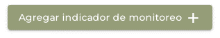
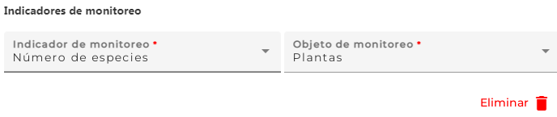

# Actividades del proyecto {.unnumbered}

 

La subsección comprende siete campos; **un campo es obligatorio (\*)**.

----

### Indique los métodos o técnicas que se usaron / usan / usarán para el proyecto de restauración {.unnumbered}
Escriba los métodos o técnicas usadas en el proyecto, p. ej., caracterización de hábitat, análisis de crecimiento, trasplante de fragmentos de corales, recolección de lluvia de semillas de árboles, observación de aves, encuesta, modelación de la distribución potencial de especies, identificación de sitios prioritarios para la restauración, meta-análisis, entre varios otros. Si copia información del documento, póngala entre comillas " " para indicar que es una cita textual. Si la información está en un idioma distinto al español, favor de traducir.

----

### Actividades de restauración\* {.unnumbered}
Seleccione todas las opciones de la lista que correspondan. 

- Seleccione ‘No determinado’ cuando no es posible determinar las actividades de restauración.
- Seleccione ‘No aplica’ cuando no es aplicable a su proyecto.

----

### Otras actividades de restauración {.unnumbered}
Escriba las actividades de restauración si no aparecen en el catálogo o quiere dar más detalles, p. ej., adición de acolchados, llenado de cárcavas, reforestación con especies medicinales nativas de la región.

----

### Indicadores de monitoreo {.unnumbered}
El monitoreo es un componente fundamental que implica la recolección continua de datos y el análisis de información para supervisar, evaluar y dar seguimiento a un proyecto en relación a sus objetivos y metas.

Pulse el botón ‘Agregar indicador de monitoreo +’ para que se desplieguen los campos y pueda capturar los datos. Si no cuenta con información, puede saltarse esta parte. 

Podrá agregar tantos sitios como desee por medio del mismo botón. 

Pulse ‘Eliminar’ sino va a capturar información.

{width="200"}

{width="700"}

----

#### Indicador de monitoreo\* {.unnumbered}
Seleccione la opción de la lista que corresponda.

- Seleccione ‘No determinado’ cuando no es posible determinar el indicador.
- Seleccione ‘No aplica’ cuando no es aplicable a su proyecto.

----
 
#### Objeto de monitoreo\* {.unnumbered}
Seleccione la opción de la lista que corresponda.

- Seleccione ‘No determinado’ cuando no es posible determinar el objeto.
- Seleccione ‘No aplica’ cuando no es aplicable a su proyecto.

----

### Otras actividades de monitoreo {.unnumbered}
Escriba las actividades de monitoreo si no aparecen en el catálogo o quiera dar más detalles, p. ej., el monitoreo de aves durante la temporada seca y de lluvias.

----

### Comentarios respecto a las actividades de restauración o monitoreo. {.unnumbered}
Campo de texto abierto que permite introducir comentarios, opiniones, etc. respecto a las actividades de restauración y/o monitoreo que considera importantes indicar.

----

### GUARDAR {.unnumbered}

**Pulse el botón ‘Guardar’, una vez que haya registrado los datos**.

En el caso de que todos los campos obligatorios hayan sido llenados, el sistema abrirá una ventana con la leyenda 'Cambios guardados'. Pulse el botón ‘Aceptar’ para asegurar que la información haya sido guardada en el sistema. Si no se abre la ventana, vuelva a presionar el botón ´Guardar´ al menos dos veces más.

Pulse el botón ‘Siguiente’ para pasar a la siguiente sección. 

Si algún campo obligatorio se encuentra vacío, el botón ‘Guardar’ estará deshabilitado.
