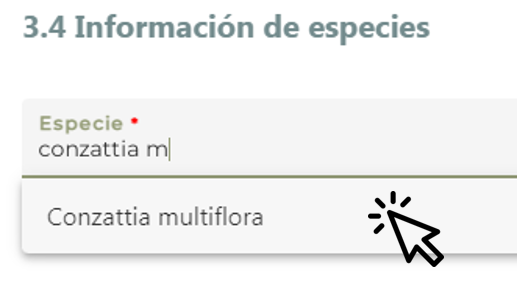

# 3.4 **Información de especies** {.unnumbered}

 

Las especies incluyen a cualquier especie que fue / es /será usada o es sujeta a manejo y evaluación en proyectos prácticos y teóricos de restauración, p. ej., especies de Bursera que fueron usadas para evaluar su germinación y crecimiento en campo; especies de Acacia que serán modeladas bajo escenarios cambio climático; especies de corales que son observadas tras ser trasplantadas; especies de manglar que son evaluadas como biofiltros en humedales; o especies de mamíferos que fueron erradicadas de islas mexicanas.

La información de las especies está vinculada con los Catálogos de Autoridades Taxonómicas (CAT) del Sistema Nacional de Información sobre Biodiversidad [(SNIB)](www.snib.mx) para obtener el nombre científico válido. 

Pulse el botón ‘Agregar especie +’ para que se desplieguen los campos y pueda capturar los datos. Podrá agregar tantas especies como desee por medio del mismo botón.

La subsección comprende tres campos; si agrega una especie, **dos de los campos son obligatorios (\*)**. 

Pulse ‘Eliminar’ sino va a capturar información.

{width="200"}

**En caso de que el proyecto no cuente con información de especies, puede omitir esta subsección; pulse directamente ‘Guardar’ y pase a la siguiente sección.**

----

### Especie\* {.unnumbered}
Seleccione el nombre científico; al teclear el nombre, aparecerá una lista de 10 opciones que se actualiza conforme siga tecleando el nombre de la especie. Si la especie es un sinónimo, el nombre válido aparecerá entre paréntesis, p. ej., _Pinus bonapartea_ (_Pinus strobiformis_).

{width="400"}

----

### Uso de la especie\* {.unnumbered}
Seleccione una opción.

- Utilizada en la restauración: Especie focal o especie usada en la restauración o refaunación o como el principal objeto de estudio, p. ej.,  _Romerolagus diazi_ (conejo zacatuche o teporingo) -el objetivo del proyecto fue identificar y caracterizar sitios potencialmente útiles para la recuperación de las poblaciones del teporingo; _Pinus oaxacana_ -el objetivo del estudio fue establecer un ensayo de la progenie del pino en Veracruz; o _Agave durangensis_ -el objetivo del estudio fue determinar la germinación y el crecimiento del agave; se plantaron algunos árboles como Pinus greggii, P. devoniana, P. montezumae (entre otros).
- No utilizada pero evaluada y monitoreada: Especie que no fue usada para la restauración sino para evaluar el efecto o impacto de la restauración, p. ej., especies de aves y murciélagos monitoreadas en un gradiente sucesional de selva bajo diferentes esquemas de restauración; o _Leptoglossus occidentalis_, un insecto que afecta las semillas de _Pinus engelmannii_ (especie usada en la restauración).
- Experimentación y otros usos: Especie que no se evalúa pero se usó/usa/usará en el proyecto, o especie sujeta a manejo p. ej. hongos micorrízicos (p. ej. _Rhizophagus intraradices_) usados para inocular plantas usadas para la restauración; especies de mamíferos que fueron erradicadas de islas mexicanas.

----

### **Comentarios respecto a las especies y su uso en el proyecto** {.unnumbered}
Campo de texto abierto que permite introducir comentarios, opiniones, etc. respecto a las especies y su uso en el proyecto que considera importantes indicar.

----

### **GUARDAR** {.unnumbered}

**Pulse el botón ‘Guardar’, una vez que haya registrado los datos**.

En el caso de que todos los campos obligatorios hayan sido llenados, el sistema abrirá una ventana con la leyenda 'Cambios guardados'. Pulse el botón ‘Aceptar’ para asegurar que la información haya sido guardada en el sistema. Si no se abre la ventana, vuelva a presionar el botón ´Guardar´ al menos dos veces más.

Pulse el botón ‘Siguiente’ para pasar a la siguiente subsección. 

Si algún campo obligatorio se encuentra vacío, el botón ‘Guardar’ estará deshabilitado.
