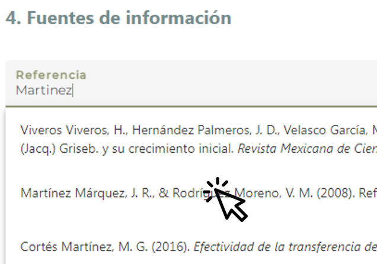

# Fuentes de información

 

La subsección comprende dos campos; ninguno es obligatorio.

----

### Referencia{.unnumbered}
Escriba el apellido o título de la referencia; no use acentos, tildes u otros caracteres especiales, p. ej., escriba Perez Gomez en vez de Pérez-Gómez; escriba Basbug en vez de Başbuğ. 

Al teclear la palabra, aparecerá una lista de 10 opciones que se actualiza conforme se sigue tecleando. Seleccione la referencia que corresponda.

Las referencias que se despliegan en la lista están albergadas en el gestor bibliográfico de Zotero, manejado por la CONABIO. Actualmente, contiene 1,600 documentos, incluyendo artículos de revistas científicas y de divulgación, capítulo de libros, informes, tesis, entre otros que fueron publicados a partir de 1990.

En caso que no encuentre una referencia en la lista, por favor, escriba la referencia en formato APA en el siguiente campo.

{width="400"}

----

### Referencia nueva{.unnumbered}
En caso que no encuentre una referencia en la lista del campo anterior, por favor, escriba la referencia en formato APA. 

Si no cuenta con una publicación, puede incluir la referencia de otra evidencia disponible en línea, p. ej., video o documental. 
En caso de no contar con algún material de referencia, escriba: Observación personal.

Puede utilizar el generador de citas [Scribbr](https://www.scribbr.es/citar/generador/), que por medio del URL (sitio web, vídeo o artículo de noticias en línea), DOI (Artículo de revista) o   ISBN (libro) realiza la búsqueda y el despliegue de la referencia en formato APA.

**Consulte las [Normas APA 7.^a^edición](https://www.revista.unam.mx/wp-content/uploads/3_Normas-APA-7-ed-2019-11-6.pdf)** para más información y ejemplos de la estructura del formato APA.

- Artículo: Apellido, A.A. y Autor/a, B.B. (año de la publicación). Título del artículo. Título - Libro: Editor/a, E. E. y Editor/a, F. F. (eds.) (año de la publicación). Título del libro (edición). Editorial.
- Capítulo de libro: Apellido, A.A. del capítulo (año de la publicación). Título del capítulo. En Editor del libro (ed.). Título del libro (pp. xx-xx). Editorial.
- Tesis: Apellido, A.A. (año de la publicación). Título de la tesis. Tesis de (grado académico). Institución de donde es egresado el autor o la autora. 
- Informe: Apellido, A.A. (año de la publicación). Título del informe. Editorial. https://doi.org/xxx o http://xxx.

----

