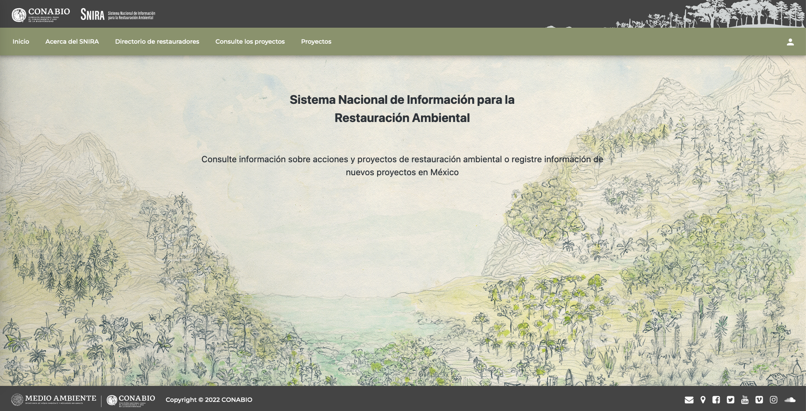

# **Manual para personas usuarias** {.unnumbered}

{width="640"}

## SNIRA {.unnumbered}

El Sistema Nacional de Información para la Restauración Ambiental [SNIRA](https://snira.conabio.gob.mx/) es una plataforma web que integra y sintetiza información relacionada con iniciativas y proyectos de restauración ambiental en el país. El término de 'restauración ambiental' se usa para abarcar todas las intervenciones, acciones y trabajos que buscan revertir o reducir las condiciones de degradación, daño o destrucción de los ecosistemas. Por lo tanto, en el SNIRA se incluyen proyectos sobre regeneración natural, restauración ecológica, rehabilitación, restauración productiva, reforestación, refaunación y remediación. Para mayor información al respecto, por favor consulte el documento de [**Enfoques y términos**](https://drive.google.com/file/d/1jmIbkg1UEZI-FfwHULiqkg-rUJExKsIc/view).

El SNIRA es un sistema de información de libre acceso a todo público, diseñado con el propósito de reunir y compartir aspectos clave sobre los proyectos de restauración, incluyendo las lecciones aprendidas con el fin de fortalecer la toma de decisiones para el desarrollo sustentable. El sistema permite realizar consultas de la información registrada en la base de datos y agregar información de nuevas actividades. Para mantener actualizada la información de las iniciativas de restauración, se invita a todas las personas que participaron o están participando en iniciativas que revisen si sus proyectos ya fueron incluidos en la base de datos (véase la pestaña 'Consulte los proyectos' y la sección 'Base de datos'). En caso de no encontrar los proyectos, la persona usuaria puede ingresar la información de trabajos de restauración en proceso de planeación, implementación o concluidos.

**Si tiene dudas, comentarios sobre el sistema o problemas de navegación, por favor escriba a [snira\@conabio.gob.mx](mailto:snira@conabio.gob.mx){.email}**.
